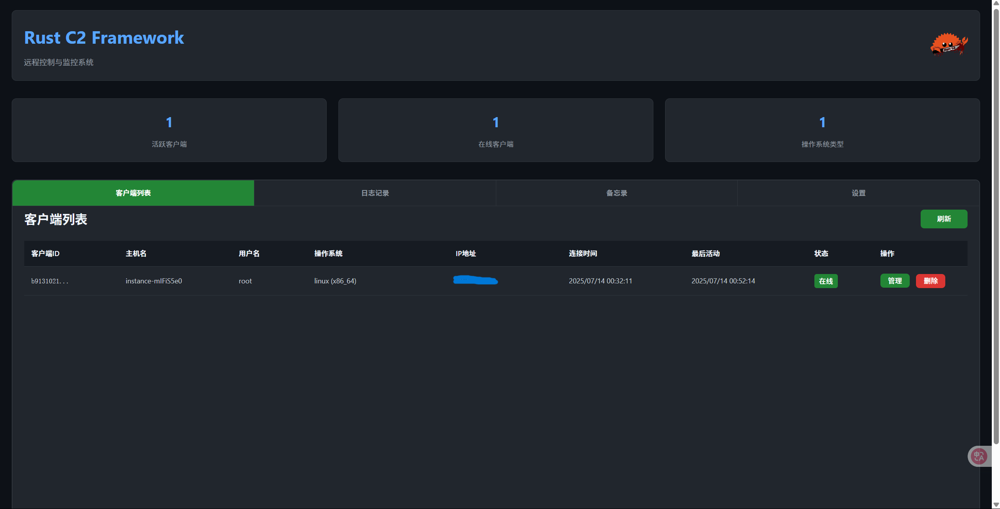
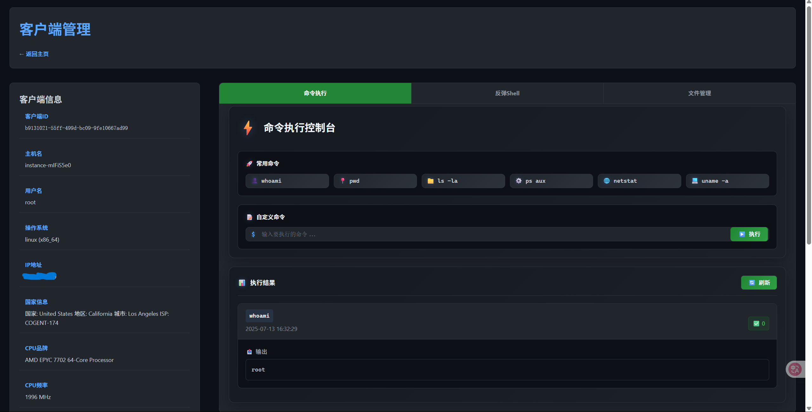
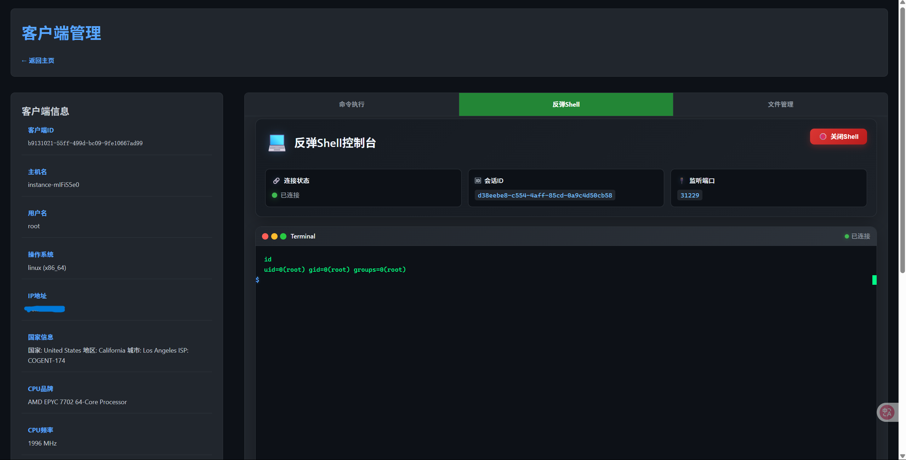
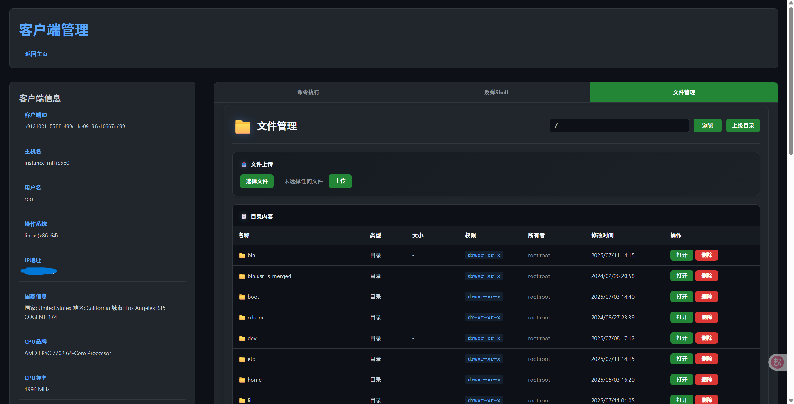
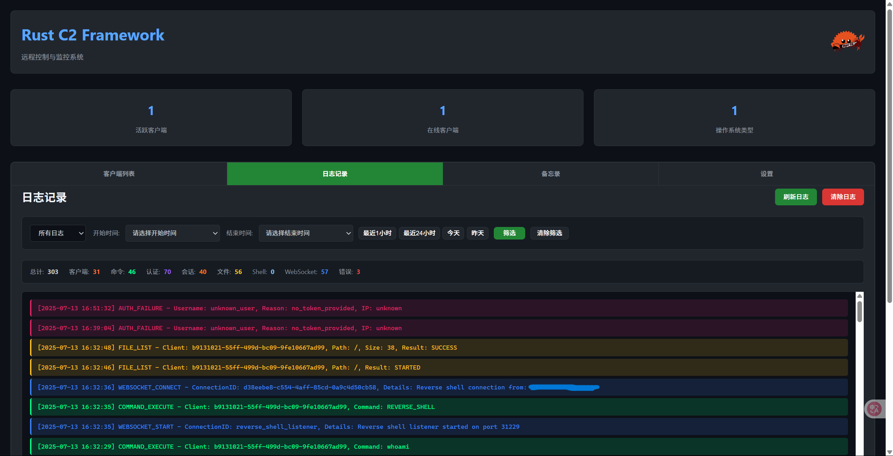

# Detailed Function Documentation

## 🎯 Web Management Interface Features

### 1. Dashboard (`/`)

- **Client Overview**: Number of online clients and operating system distribution statistics
- **Client List**: Display information of all connected clients
- **Real-time Status**: Client connection status and last seen time
- **System Information**: CPU, memory, and disk usage



### 2. Client Details Page (`/client/{id}`)

- **Basic Information**: Hostname, username, IP address, operating system
- **Hardware Information**: CPU brand, frequency, core count, memory size
- **Storage Information**: Total disk capacity and available space
- **Function Tabs**:
  - 📟 **Command Execution**: Real-time command execution and result display
  - 🖥️ **Reverse Shell**: Interactive shell terminal
  - 📁 **File Management**: File browsing, upload, download
  - 📋 **Log Viewing**: Operation logs and system logs
  - 📝 **Notes**: Penetration testing notes and discovery records

## 🔧 Core Function Usage

### 1. Command Execution

```javascript
// Enter commands in the command execution panel
whoami
uname -a
ps aux
netstat -tulpn
```



### 2. Reverse Shell

1. Click the "Start Reverse Shell" button
2. System automatically starts listener and sends connection command to client
3. Perform interactive operations in the terminal interface



### 3. File Management

- **Browse Directory**: Click directory name to enter
- **Upload Files**: Drag files to upload area or click to select files
- **Download Files**: Click file name or download button
- **Delete Files**: Select files and click delete button



### 4. Log Management

- **Real-time Logs**: Automatically updated operation logs
- **Log Filtering**: Filter logs by type and level
- **Log Cleanup**: Clear historical log records



## 🔒 Detailed Security Features

### 1. Communication Encryption

- **AES-256-GCM**: Encrypt all sensitive data transmission
- **Key Management**: Server and client shared key authentication
- **Integrity Verification**: GCM mode provides data integrity checking

### 2. Authentication

- **Web Interface Authentication**: Username/password login verification
- **Session Management**: Cookie-based secure sessions
- **Route Protection**: Middleware-level access control

### 3. Audit and Logging

- **Operation Audit**: Record all client operations and command executions
- **Connection Tracking**: Detailed connection establishment and disconnection logs
- **Error Recording**: Complete recording of system errors and exceptions

### 4. Process Security

- **On-Demand Startup**: Reverse shell listeners start only when needed
- **Process Hiding**: Client process hiding techniques
- **Memory Safety**: Rust's memory safety guarantees

## 🔧 Development Guide

### Project Architecture Design

#### 1. Modular Design Principles

- **`common`**: Core shared library, defining communication protocols, encryption tools, configuration management
- **`server`**: Server-side business logic, client management, web interface, API services
- **`client`**: Client-side functionality implementation, command execution, file operations, reverse shell

#### 2. Asynchronous Programming Pattern

- Use Tokio asynchronous runtime
- async/await syntax sugar
- Non-blocking I/O operations
- Concurrent task management

#### 3. Message Protocol Design

```rust
// Message type definitions
pub enum MessageType {
    ClientRegister,       // Client registration
    Heartbeat,           // Heartbeat maintenance
    ExecuteCommand,      // Command execution
    CommandResult,       // Command result
    ReverseShell,        // Reverse shell
    ShellData,          // Shell data
    ListDir,            // Directory listing
    DeletePath,         // Delete path
    UploadFileInit,     // Upload initialization
    UploadFileChunk,    // Upload data chunk
    DownloadFileInit,   // Download initialization
    DownloadFileChunk,  // Download data chunk
    Error,              // Error message
    FileOperationResponse, // File operation response
}
```

### Adding New Features

#### 1. Add New Message Types

```rust
// 1. Add new MessageType in common/src/message.rs
pub enum MessageType {
    // Existing types...
    NewFeature,  // New feature
}

// 2. Define corresponding data structures
#[derive(Debug, Clone, Serialize, Deserialize)]
pub struct NewFeatureRequest {
    pub param1: String,
    pub param2: i32,
}
```

#### 2. Implement Server-side Handling

```rust
// Add new API endpoint in server/src/handlers/api.rs
pub async fn handle_new_feature(
    State(state): State<AppState>,
    Json(request): Json<NewFeatureRequest>,
) -> Result<Json<Response>, StatusCode> {
    // Processing logic
}
```

#### 3. Implement Client-side Functionality

```rust
// Add corresponding function module in client/src/
pub async fn execute_new_feature(request: NewFeatureRequest) -> C2Result<Response> {
    // Client execution logic
}
```

### Compilation Optimization Configuration

The project has configured compilation optimizations, defined in `Cargo.toml`:

```toml
[profile.release]
lto = true                # Link-time optimization
codegen-units = 1         # Single code generation unit
panic = "abort"           # Abort on panic
strip = true              # Strip debug symbols
opt-level = "z"           # Optimize for size
```

### Testing Strategy

```bash
# Run all tests
cargo test

# Run specific module tests
cargo test --package common
cargo test --package server
cargo test --package client

# Run benchmark tests
cargo bench
```

## 📊 Performance Characteristics

### System Performance

- **Concurrent Connections**: Support 1000+ concurrent client connections
- **Memory Usage**: Server memory usage < 50MB
- **Startup Time**: Server startup time < 3 seconds
- **Response Latency**: API response latency < 100ms

### Network Performance

- **File Transfer**: Support 100MB+ file chunked transmission
- **Real-time Communication**: WebSocket latency < 50ms
- **Encryption Performance**: AES-256-GCM encryption/decryption > 100MB/s

### Resource Optimization

- **Binary Size**: Release version < 10MB
- **Static Linking**: Support complete static linking deployment
- **Cross Compilation**: Support multi-platform cross compilation

## 🐛 Troubleshooting

### Common Issues

#### 1. Compilation Errors

```bash
# Ensure Rust version is new enough
rustup update

# Clean and recompile
cargo clean
cargo build --release
```

#### 2. Connection Issues

```bash
# Check firewall settings
sudo ufw status
sudo firewall-cmd --list-all

# Check port usage
netstat -tulpn | grep :8080
netstat -tulpn | grep :31229
```

#### 3. Configuration File Errors

```bash
# Verify TOML format
cargo run --bin server --dry-run

# Check file permissions
chmod 644 server_config.toml
chmod 644 client_config.toml
```

#### 4. WebSocket Connection Failures

- Check browser console error messages
- Confirm WebSocket URL is correct
- Check proxy settings

### Debug Logging

Enable detailed logging:

```bash
# Set log level
export RUST_LOG=debug
cargo run --bin server

# Or use trace level
export RUST_LOG=trace
cargo run --bin server
```

## 📄 API Documentation

### RESTful API Endpoints

#### Client Management

- `GET /api/clients` - Get all client list
- `GET /api/clients/display` - Get display client information
- `DELETE /api/clients/{id}` - Delete specified client
- `GET /api/clients/{id}/results` - Get client command results

#### Command Execution

- `POST /api/clients/{id}/commands` - Send command to client
- `POST /api/clients/{id}/reverse_shell` - Start reverse shell

#### Reverse Shell Management

- `GET /api/reverse_shells` - List active reverse shell connections
- `POST /api/reverse_shells/{id}/close` - Close reverse shell connection
- `GET /ws/shell/{id}` - WebSocket connection to reverse shell

#### File Operations

- `POST /api/files/list` - List directory contents
- `POST /api/files/delete` - Delete file or directory
- `GET /api/files/download/{path}` - Download file
- `POST /api/files/upload/{path}` - Upload file

#### Logs and Notes

- `GET /api/logs` - Get system logs
- `POST /api/logs/clear` - Clear logs
- `GET /api/notes` - Get all notes
- `POST /api/notes` - Create new note
- `PUT /api/notes/{id}` - Update note
- `DELETE /api/notes/{id}` - Delete note

#### Client API Endpoints

- `POST /api/register` - Client registration
- `POST /api/heartbeat` - Heartbeat maintenance
- `GET /api/commands/{id}` - Get pending commands
- `POST /api/command_result` - Submit command execution result
- `POST /api/file_operation_response/{id}` - Submit file operation result
