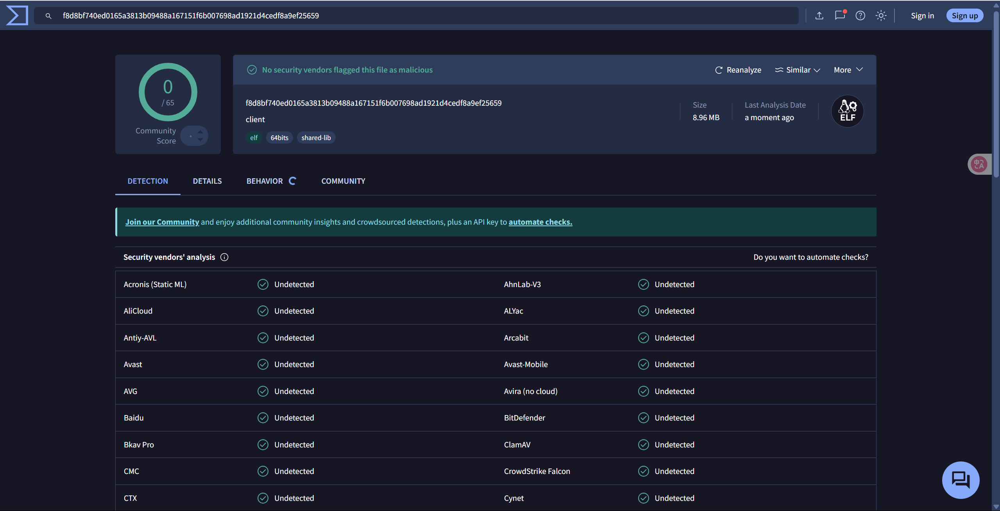
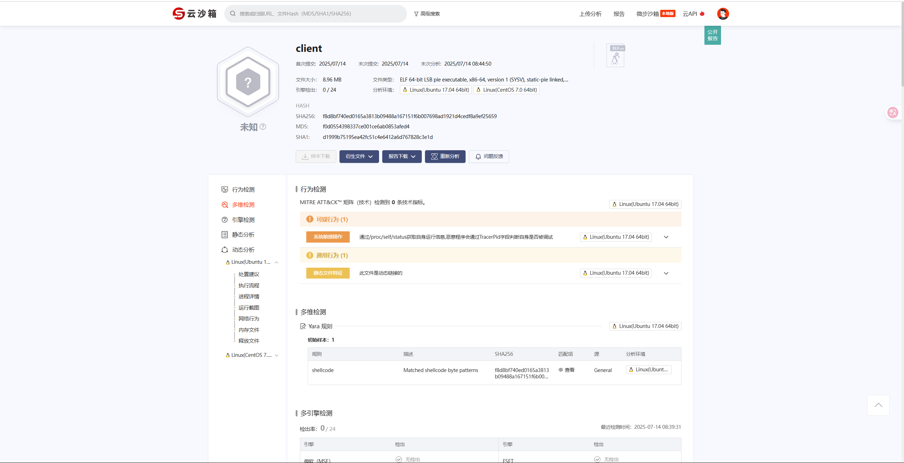

# Rust C2 Framework

<!-- markdownlint-disable MD033 -->
<h1 align="center">
  <br>
  
</h1>
<p align="center">
    
    
	
    
    
</p>
<!-- markdownlint-enable MD033 -->

A modern, secure, high-performance Command & Control solution 🦀. A modernized command and control (C2) framework built from scratch using Rust, designed to provide a high-performance, secure, and modular platform for remote system management and penetration testing. The framework includes independent client, server, and an intuitive web management interface.

## 🚀 Features

### Core Features

- 🔗 **Linux Platform Support**: Client only support Linux operating systems, Server support Windows and Linux operating systems
- 🔐 **End-to-End Encrypted Communication**: Uses AES-256-GCM encryption algorithm to ensure confidentiality and integrity of communication data
- 🌐 **Modern Web Management Interface**: Built on Axum web framework and Askama template engine, providing responsive user experience
- ⚡ **High-Performance Async Architecture**: Built with Tokio runtime for efficient concurrent processing and low-latency communication
- 📝 **Flexible Configuration Management**: Easily adjust parameters through TOML configuration files without recompilation

### Advanced Features

- 💻 **Real-time Command Execution**: Support remote system command execution with instant result retrieval and encrypted transmission
- 🖥️ **Interactive Reverse Shell**: Provides stable reverse shell sessions for deep interaction with controlled hosts
- 📁 **Complete File Management**: File browsing, upload, download, deletion with support for large file chunked transmission
- 📊 **Real-time Client Monitoring**: Display detailed information, activity status, and system information of connected clients
- 🔍 **Audit Log System**: Record all operational activities with support for log categorization and real-time viewing
- 📝 **Note Management**: Built-in note system for recording penetration testing processes and findings

### Security Features

- 🛡️ **On-Demand Listener Startup**: Reverse shell listeners start on-demand to reduce attack surface
- 🔑 **Authentication**: Web interface user authentication and session management
- 📋 **Operation Audit**: Complete operation audit chain supporting security compliance
- 🔒 **Process Hiding**: Client process hiding techniques
- 🔍 **Anti-Reverse**: Code obfuscation and anti-debugging techniques
- 📦 **Anti-Sandbox**: Sandbox environment detection and evasion

## 📋 Project Structure

Modular architecture managed with Cargo workspace:

```text
rust-c2-framework/
├── Cargo.toml                    # Workspace configuration file
├── server_config.toml            # Server configuration file
├── common/          # Shared library (protocols, encryption, configuration)
├── server/          # Server-side (web interface, API, client management)
├── client/          # Client-side (command execution, file operations, reverse shell)
└── web/static/      # Frontend resources (CSS, JS, images)
```

## ⚙️ Configuration Files

### Server Configuration (`server_config.toml`)

```toml
# Server network configuration
host = "0.0.0.0"                              # Server listening address
port = 8080                                   # Web service port
reverse_shell_port = 31229                    # Dedicated reverse shell port

# Security configuration
encryption_key = "your-32-byte-secret-key-here!!!!"  # AES-256 key (must be 32 bytes)

# Client management
client_timeout = 60                           # Client timeout (seconds)
max_clients = 1000                           # Maximum client connections

# Logging configuration
log_file = "c2_server.log"                   # Log file path
enable_audit = true                          # Enable audit logging

# Web interface configuration
[web]
enabled = true                               # Enable web interface
static_dir = "web/static"                    # Static files directory
template_dir = "server/templates"            # Template files directory
enable_cors = true                           # Enable CORS
refresh_interval = 5                         # Auto refresh interval (seconds)

# Authentication configuration
[auth]
username = "Rust-Admin"                      # Login username
password = "Passwd@RustC2"                   # Login password
```

## 🚀 Quick Start

### 1. Install Rust Environment

```bash
# Install Rust (if not already installed)
curl --proto '=https' --tlsv1.2 -sSf https://sh.rustup.rs | sh
source ~/.cargo/env

# Verify installation
rustc --version
cargo --version
```

### 2. Clone and Compile Project

```bash
# Clone project
git clone https://github.com/waiwai24/rust-c2-framework
cd rust-c2-framework

# Compile entire workspace (recommended)
cargo build --release

# Or compile individual components
cargo build --release --bin server
cargo build --release --bin client
```

Compiled binary files are located in the `target/release/` directory.

### 3. Static Compilation (Optional)

To generate standalone executable files that don't depend on system libraries:

```bash
# Add musl target
rustup target add x86_64-unknown-linux-musl

# Static compilation
cargo build --release --target x86_64-unknown-linux-musl

# Use UPX compression (optional)
sudo apt-get install upx
upx --best target/x86_64-unknown-linux-musl/release/server
upx --best target/x86_64-unknown-linux-musl/release/client
```

### 4. Configuration and Startup

#### Start Server

```bash
# Run with cargo (development environment)
cargo run --bin server

# Or run binary file directly (production environment)
./target/release/server
```

After server startup, visit `http://localhost:8080` to access the web management interface.

Default login credentials:

- Username: `Rust-Admin`
- Password: `Passwd@RustC2`

#### Configure and Start Client

Ensure encryption key matches the server, then start the client:

```bash
# Use configuration file
cargo run --bin client

# Or specify server address
cargo run --bin client http://your-server-ip:8080

# Run binary file directly
./target/release/client
```

Client-side cloud sandbox detection（time：2025/7/14）：

<!-- markdownlint-disable MD033 -->
<div style="display: flex; justify-content: center; gap: 20px;">
    
    
</div>
<!-- markdownlint-disable MD033 -->

For detailed usage guide, please refer to [EN-Function.md](EN-Function.md).

## 🔄 Changelog

### v0.1.0 (Latest Version)

- ✅ Complete C2 framework implementation
- ✅ Reverse shell functionality (on-demand listener startup)
- ✅ File management system (upload/download/browse)
- ✅ Real-time web interface
- ✅ AES-256-GCM encrypted communication
- ✅ Client status monitoring
- ✅ Audit log system
- ✅ Note management functionality
- ✅ WebSocket real-time communication
- ✅ Modular frontend design
- ✅ Responsive interface layout

### Known Issues

- Complete testing on Linux platform requires further verification
- File transfer progress display needs optimization
- Transmission encryption needs improvement

### Planned Features

- [ ] Windows client support
- [ ] macOS client support  
- [ ] Android client support
- [ ] Plugin system
- [ ] Tunneling functionality

## ⚠️ Disclaimer

**Important Notice**: This project is for educational and research purposes only. Do not use it for any illegal or malicious activities. Users are responsible for all consequences of using this software.

### Legal Use Statement

- ✅ Network security education and training
- ✅ Penetration testing (with authorization)
- ✅ Red team exercises (compliant environment)
- ❌ Unauthorized system access
- ❌ Malware distribution
- ❌ Illegal criminal activities

Before using this tool, ensure:

1. Obtain explicit authorization from target system owners
2. Comply with local laws and regulations
3. Use only in legal and compliant environments
4. Accept corresponding legal responsibilities

## 📄 License

This project is licensed under the MIT License. See the [LICENSE](LICENSE) file for details.

## Star History

[](https://www.star-history.com/#waiwai24/rust-c2-framework&Date)
